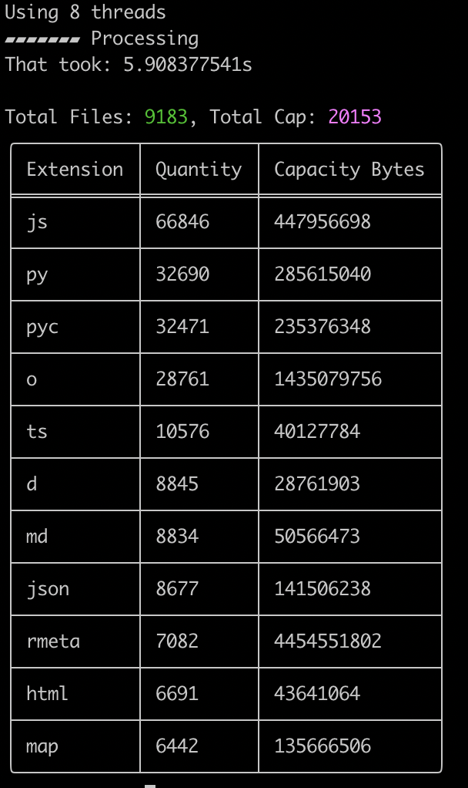

# fast-walk

Mini project to scan a filesystem to get the quantity and capacity of each extension. 

Compile from source.

- Install Rust https://www.rust-lang.org/tools/install 
- Clone this repo
- Run the following in the following command

cargo:

    cargo build --release

The file will be in the target/release folder.

## Building with Docker

If you would rather not install a toolchain, the `Dockerfile` builds it for
you:

    docker build -t fast-walk .

Scanning needs two mounts: the tree to look at, and somewhere for the results
to land. The scan target can be read-only, since nothing is ever written to it:

    docker run --rm -v /srv/share:/scan:ro -v "$PWD":/out fast-walk -p /scan

Every option works as it does outside a container, so `-p /scan --skip-hidden
-o monday` behaves the same way. The results go to the working directory, which
is why `/out` is mounted; without it the CSVs are written inside the container
and disappear with it.

If the binary is what you actually want, take it and drop the image. It is a
normal dynamically linked glibc binary, so it runs on any comparable Linux, not
only inside a container:

    docker create --name fw fast-walk
    docker cp fw:/usr/local/bin/fast-walk .
    docker rm fw

**A container runs as root by default, and root bypasses permission bits.** For
this tool that is not a detail: a scan as root reports files that the account
running your backup may not be able to read, so the totals can come out higher
than what will actually be protected. Pass `--user` to scan as yourself, which
also leaves the results files owned by you rather than by root:

    docker run --rm --user "$(id -u):$(id -g)" \
        -v /srv/share:/scan:ro -v "$PWD":/out fast-walk -p /scan

Dependencies are built in their own layer, so editing the source and rebuilding
does not recompile them: a cold build took 22.6 seconds here and a rebuild
after a source change took 2.7, with only `fast-walk` itself recompiling. The
Rust version is pinned in the `Dockerfile` rather than tracking `latest`, so it
needs bumping deliberately.

What has been checked, on Docker 29.6 with Docker Desktop on macOS and an
arm64 image: the container scans the standard fixture to 20,232 files and
1,435,762,672 bytes, matching the documented totals exactly; all six CSVs land
in the mounted directory; `--cpus=2` is picked up correctly, so the thread
default respects a container CPU limit rather than seeing the whole host; and a
`--user` run produces the same totals with the output owned by the caller. The
image has not been built or run on a Linux host, nor on amd64.

## How to use

Run app in terminal.

    fast-walk

    USAGE:
        fast-walk [OPTIONS] --path <PATH>

    OPTIONS:
        -h, --help                     Print help information
        -V, --version                  Print version
        -m, --max-depth <MAX_DEPTH>    [default: 18446744073709551615]
        -p, --path <PATH>
        -t, --threads <THREADS>        [default: 8]
            --skip-hidden              Skip hidden files and directories
        -o, --output <PATH>            Base name for the results files [default: timestamped]
            --top <TOP>                Largest files to report, 0 disables [default: 10]
            --hotspots <HOTSPOTS>      Small-file directories to report, 0 disables [default: 10]
            --small-under <SIZE>       What counts as a small file [default: 64K]
            --diff <OLD> <NEW>         Compare two results CSVs instead of scanning

Example running on the same directory as the application, max depth 5, threads 4

    ./fast-walk -p . -m 5 -t 4

App uses the total system threads if threads are not set.

Max depth can be useful for testing speed.

Hidden files and directories are included by default, so dot-directories such as
`.git` count towards the totals. Pass `--skip-hidden` to leave them out.

If a directory cannot be read it is reported as a warning and its contents are
missing from the totals. If the path given to `--path` cannot be read at all,
the tool exits with an error rather than reporting an empty scan.

## Scanning network shares

To run against an SMB or NFS share, scan a snapshot rather than the live tree:
the results are consistent, production is left alone, and there is nothing to
damage. See [docs/snapshot-scanning.md](docs/snapshot-scanning.md) for mounting,
tuning, and the snapshot directory traps to avoid.

A scan over SMB has been checked against a scan of the same tree taken locally
on the server, and the two produce identical output. The `actimeo` mount option
matters more than the thread count for large shares; both are covered there.

Which transports and servers have actually been run against, and which are still
only reasoned about, is tracked in [TESTING.md](TESTING.md). NAS appliances
cannot be reproduced in CI, so results from other people's hardware are the only
way that list gets shorter — reports are very welcome, including ones where it
did not work.

## Output

Tools outputs a CSV of the extensions arranged by quantity, also includes total capacity in bytes.

The extension is the part of the file name after the final ".", so `archive.tar.gz`
counts as `gz`. Files with no extension are grouped under `<none>`; this includes
dotfiles such as `.gitignore`, which are treated as having no extension rather
than an extension of `gitignore`.

Both the table and the CSV report the average file size for each extension, and
the summary line reports the average across every file scanned.

The CSV reports capacity and average size in bytes. The terminal table reports
capacity in MB and scales the average to whichever unit suits it, since average
file sizes are usually far below a megabyte.

### Where the results go

A scan writes six CSVs, sharing one name stem. By default the stem is a UTC
timestamp, so a series of scans sorts chronologically and one run never
overwrites another:

    results-20260801-160000.csv            totals per extension
    results-20260801-160000-age.csv        totals per age band
    results-20260801-160000-size.csv       totals per size band
    results-20260801-160000-structure.csv  how the tree is laid out
    results-20260801-160000-hotspots.csv   directories holding the most small files
    results-20260801-160000-largest.csv    the largest files found

`--output` sets the stem instead, which is what you want when something else
has to find the files afterwards:

    fast-walk -p /mnt/share -o monday

    monday.csv
    monday-age.csv
    monday-size.csv
    monday-structure.csv
    monday-hotspots.csv
    monday-largest.csv

A `.csv` extension is optional and stripped before the suffixes are added, so
`-o monday.csv` gives `monday-age.csv` rather than `monday.csv-age.csv`. The
value may include a directory, and the files are written there rather than to
the working directory. `--output` applies to `--diff` too.

Files are written relative to the working directory unless `--output` gives a
path, so when scanning a network share, run from local disk or pass an
`--output` that points there.

The timestamp is to the second. Two scans started within the same second write
the same names, and the second overwrites the first; pass `--output` if that is
a possibility.

### By age

Files are also grouped by how long ago they were last modified, into bands of
under 30 days, 30 to 90 days, 90 days to a year, 1 to 2 years, and over 2 years,
with each band's share of total capacity. This is what tells you how much of a
share is cold data.

The modification time comes from the same `stat` the scan already performs, so
the age report costs nothing extra — including over a network mount.

Two bands exist for data that cannot be aged normally. Files modified *after*
the scan started are reported as `modified in future` rather than being counted
as new; this normally means the clocks on the scanning host and the file server
disagree. Files whose modification time the filesystem does not report land in
`unknown`.

### By file size

Files are also grouped into size bands, with each band's share of both the file
count and the capacity. Backup throughput is governed by per-file overhead as
much as by bytes, so a share that is mostly small files takes far longer to back
up than its size suggests. The two columns together are what show it:

    ╭─────────────────┬──────────┬────────────┬─────────────┬──────────╮
    │ Size            │ Quantity │ % of Files │ Capacity MB │ % of Cap │
    ╞═════════════════╪══════════╪════════════╪═════════════╪══════════╡
    │ empty           │ 117      │ 0.2%       │ 0.00        │ 0.0%     │
    │ under 4 KB      │ 43424    │ 63.7%      │ 51.26       │ 1.5%     │
    │ 4 KB to 64 KB   │ 21954    │ 32.2%      │ 337.64      │ 9.9%     │
    │ 64 KB to 1 MB   │ 2324     │ 3.4%       │ 450.37      │ 13.2%    │
    │ 1 MB to 16 MB   │ 286      │ 0.4%       │ 1055.03     │ 31.0%    │
    │ 16 MB to 128 MB │ 27       │ 0.0%       │ 1242.89     │ 36.5%    │
    │ over 128 MB     │ 2        │ 0.0%       │ 271.14      │ 8.0%     │
    ╰─────────────────┴──────────┴────────────┴─────────────┴──────────╯

Here 96% of the files hold 11% of the data. The bands are deliberately fine at
the bottom of the range and coarse at the top, because that is where the
difference in backup time lives. Empty files get their own band since they are
pure per-file overhead with no payload at all.

### Directory structure

Two shares holding the same files can behave completely differently depending
on how those files are arranged. A million files in one directory, a tree
twenty levels deep, and paths too long for the restore target are all things
that decide how a backup runs and none of them show up in a total.

This report describes the layout in counts and lengths only. It names nothing,
so it can be pasted into a ticket or sent to a vendor without disclosing a
single directory name:

    Directory structure
    605 directories, deepest level 7, 5.9 files per directory on average
    Longest path below the scan root: 123 characters

    By level, where level 1 is the immediate children of the scan root
    ╭───────┬─────────────┬───────────┬───────┬────────────╮
    │ Level │ Directories │ % of Dirs │ Files │ % of Files │
    ╞═══════╪═════════════╪═══════════╪═══════╪════════════╡
    │ 0     │ 1           │ 0.2%      │ 0     │ 0.0%       │
    │ 1     │ 8           │ 1.3%      │ 8     │ 0.2%       │
    │ 2     │ 10          │ 1.7%      │ 19    │ 0.5%       │
    │ 3     │ 68          │ 11.2%     │ 26    │ 0.7%       │
    │ 4     │ 447         │ 73.9%     │ 1323  │ 36.9%      │
    │ 5     │ 70          │ 11.6%     │ 1605  │ 44.8%      │
    │ 6     │ 1           │ 0.2%      │ 599   │ 16.7%      │
    │ 7     │ 0           │ 0.0%      │ 1     │ 0.0%       │
    ╰───────┴─────────────┴───────────┴───────┴────────────╯

    Files per directory
    ╭──────────────┬─────────────┬───────────┬────────────┬────────────╮
    │ Files        │ Directories │ % of Dirs │ Files Held │ % of Files │
    ╞══════════════╪═════════════╪═══════════╪════════════╪════════════╡
    │ none         │ 46          │ 7.6%      │ 0          │ 0.0%       │
    │ 1 to 9       │ 554         │ 91.6%     │ 1798       │ 50.2%      │
    │ 10 to 99     │ 1           │ 0.2%      │ 14         │ 0.4%       │
    │ 100 to 999   │ 3           │ 0.5%      │ 520        │ 14.5%      │
    │ 1000 to 9999 │ 1           │ 0.2%      │ 1249       │ 34.9%      │
    ╰──────────────┴─────────────┴───────────┴────────────┴────────────╯

A third table bands directories by how many subdirectories they hold, which is
what separates a wide tree from a long chain: a share where almost every
directory is a leaf is flat, and one where almost every directory holds exactly
one subdirectory is a chain.

Level 1 is the immediate children of the scan root, matching `--max-depth`, so
a file sitting directly in the root is at level 1. Files count at the level
they sit at; in the band tables they count towards the directory holding them.

Path lengths are measured **below the scan root**, excluding the prefix the
tree currently sits under, because that prefix does not survive being copied or
restored somewhere else. Anything longer than 260 characters is counted and
called out, since that is where backup agents on Windows start to fail. Add the
length of the destination prefix to judge whether a restore will fit.

Directories that were counted but never listed — stopped by `--max-depth` or by
a permission failure — are reported as such and left out of the two band
tables, since their contents are unknown rather than empty.

Unlike the hotspot report, this one is free: the counts come from the directory
listing the walk already performs, one update per directory rather than per
file, into a fixed set of counters that do not grow with the tree. Interleaved
runs on macOS 15 with a local APFS disk and 10 threads showed no difference
that rose above run-to-run variance, on trees of 20,232 files over 17
directories, 20,800 files over 5,621 directories, and 30,625 files over 31,886
directories. It has not been measured over SMB or NFS, nor on trees with
hundreds of thousands of directories.

### Small-file hotspots

Knowing a share is full of small files does not tell you what to do about it.
The hotspot report names the directories holding them, so those paths can be
split into their own backup job, excluded, or archived:

    Directories holding the most files of 64.0 KB or smaller
    ╭────────────────────────────────────────────────┬───────┬───────┬─────────┬─────────────┬──────────╮
    │ Directory                                      │ Files │ Small │ % Small │ Capacity MB │ Avg Size │
    ╞════════════════════════════════════════════════╪═══════╪═══════╪═════════╪═════════════╪══════════╡
    │ /usr/local/go1.25.1/test/fixedbugs             │ 1818  │ 1816  │ 99.9%   │ 5.01        │ 2.8 KB   │
    │ /usr/local/go1.25.1/src/cmd/go/testdata/script │ 892   │ 892   │ 100.0%  │ 1.24        │ 1.4 KB   │
    │ /usr/share/icons/ubuntu-mono-light/status/22   │ 810   │ 810   │ 100.0%  │ 0.74        │ 952 B    │
    ╰────────────────────────────────────────────────┴───────┴───────┴─────────┴─────────────┴──────────╯

Files count towards the directory that holds them, not towards its parents, so
a listed path is one you can act on directly rather than a rolled-up total.
Directories holding no small files are left out.

`--small-under` sets the threshold, accepting a byte count or a `K`, `M` or `G`
suffix; the default of `64K` is around where per-file overhead starts to
dominate for most backup software. `--hotspots N` changes how many directories
are listed and `--hotspots 0` turns the report off.

Unlike the other reports, this one is not free: it keeps a running total per
directory, which costs memory proportional to the number of directories and
measured about 18% of scan time on a 68,000 file tree. The headline small-file
count below the size table is a whole-scan total and stays accurate even with
`--hotspots 0`.

### Largest files

The largest files found are listed with their full paths, ten by default.
`--top 50` asks for more, `--top 0` turns the report off. Aggregates tell you
which extension is consuming capacity; this tells you which files to go look at.

### Comparing two scans

Point `--diff` at the extension CSVs from two earlier runs to see what changed
between them. Nothing is rescanned, so snapshots taken weeks apart can be
compared long after the fact:

    fast-walk --diff results-monday.csv results-friday.csv

    Files: 3 -> 4 (+1)
    Capacity: 2.1 MB -> 11.2 MB (+9.1 MB)

    ╭────────────┬─────────┬────────────┬────────────┬───────────╮
    │ Extension  │ Δ Files │ Δ Capacity │ Cap Before │ Cap After │
    ╞════════════╪═════════╪════════════╪════════════╪═══════════╡
    │ mp4        │ +1      │ +8.6 MB    │ 1.9 MB     │ 10.5 MB   │
    │ docx       │ 0       │ +293.0 KB  │ 97.7 KB    │ 390.6 KB  │
    │ pdf (new)  │ +1      │ +293.0 KB  │ 0 B        │ 293.0 KB  │
    │ txt (gone) │ -1      │ -48.8 KB   │ 48.8 KB    │ 0 B       │
    ╰────────────┴─────────┴────────────┴────────────┴───────────╯

Extensions that did not change are left out, and the rest are ordered by how
much capacity moved, in either direction. Extensions present in only one of the
two scans are marked `(new)` or `(gone)`. The comparison is written to a
`diff-XXXXXX.csv` alongside the terminal output.

Columns are matched by header name, so a CSV written by a different version of
the tool still reads as long as it carries `Extension`, `Qty` and `Cap Bytes`.

Sizes are apparent file sizes rather than space consumed on disk, and a hard
linked file is counted once per name. See
[docs/snapshot-scanning.md](docs/snapshot-scanning.md) for what that means when
interpreting the totals.

The top 10 files are displayed in a table in the terminal. 

