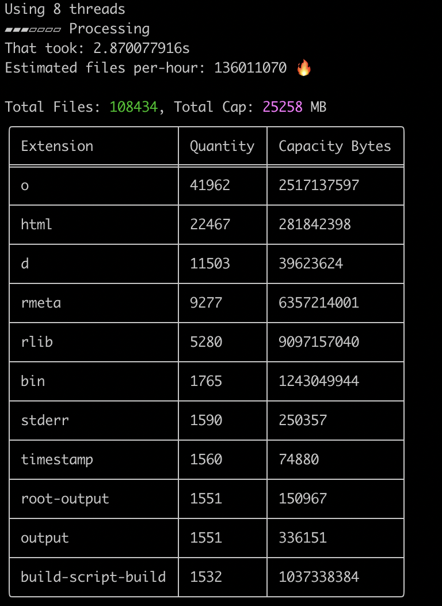

# fast-walk

Mini project to scan a filesystem to get the quantity and capacity of each extension. 

Compile from source.

- Install Rust https://www.rust-lang.org/tools/install 
- Clone this repo
- Run the following in the following command

cargo:

    cargo build --release

The file will be in the target/release folder.

## How to use

Run app in terminal.

    fast-walk

    USAGE:
        fast-walk [OPTIONS] --path <PATH>

    OPTIONS:
        -h, --help                     Print help information
        -m, --max-depth <MAX_DEPTH>    [default: 18446744073709551615]
        -p, --path <PATH>
        -t, --threads <THREADS>        [default: 8]

Example running on the same directory as the application, max depth 5, threads 4

    ./fast-walk -p . -m 5 -t 4

App uses the total system threads if threads are not set.

Max depth can be useful for testing speed. 

## Output

Tools outputs a CSV of the extensions arranged by quantity, also includes total capacit in bytes.

The top 10 files are displayed in a table in the terminal. 

